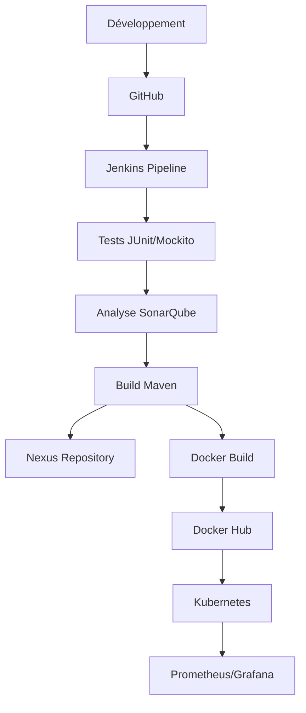

# 🚀 Projet DevOps - 4TWIN4

[](https://spring.io/projects/spring-boot)
[](https://angular.io/)
[](https://www.jenkins.io/)
[](https://www.docker.com/)
[](https://kubernetes.io/)
[](LICENSE)

## 📋 Table des Matières
- [Aperçu](#-aperçu)
- [Architecture](#-architecture)
- [Technologies](#-technologies)
- [Prérequis](#-prérequis)
- [Pipeline DevOps](#-pipeline-devops)
- [Déploiement](#-déploiement)
- [Surveillance](#-surveillance)
- [Documentation](#-documentation)

## 🎯 Aperçu
Ce projet implémente une solution DevOps complète pour une application moderne utilisant Spring Boot et Angular. Il met en œuvre les meilleures pratiques DevOps, de l'intégration continue au déploiement continu, en passant par la surveillance et l'observabilité.

## 🏗 Architecture


## 🛠 Technologies
### Backend
- **Spring Boot** - Framework Java pour le backend
- **Maven** - Gestion des dépendances et build
- **JUnit & Mockito** - Tests unitaires
- **MySQL** - Base de données

### Frontend
- **Angular** - Framework frontend
- **TypeScript** - Langage de programmation
- **Material Design** - Framework UI

### DevOps
- **Jenkins** - Automatisation CI/CD
- **Docker** - Containerisation
- **Kubernetes** - Orchestration
- **Nexus** - Gestion des artéfacts
- **SonarQube** - Qualité du code
- **JaCoCo** - Couverture de code

### Monitoring
- **Prometheus** - Collecte de métriques
- **Grafana** - Visualisation

## ⚙️ Prérequis
- JDK 17
- Node.js 14+
- Docker
- Kubernetes cluster
- Jenkins
- Maven
- Git
- angular 15

## 📦 Pipeline DevOps

Notre pipeline Jenkins comprend les étapes suivantes :

1. **Build & Test**
   - Compilation du code
   - Exécution des tests unitaires
   - Analyse de la couverture du code

2. **Qualité du Code**
   - Analyse SonarQube
   - Vérification des seuils de qualité

3. **Containerisation**
   - Build des images Docker
   - Push vers Docker Hub

4. **Déploiement**
   - Déploiement sur Kubernetes
   - Tests de smoke
   - Validation des services

## 🌐 Déploiement

### Kubernetes
```yaml
# Exemple de déploiement
apiVersion: apps/v1
kind: Deployment
metadata:
  name: app-deployment
spec:
  replicas: 3
  selector:
    matchLabels:
      app: myapp
```

## 📊 Surveillance

- **Prometheus** : Collecte des métriques
  - Performances applicatives
  - Métriques système
  - Alerting

- **Grafana** : Tableaux de bord
  - Visualisation en temps réel
  - Analyse des tendances
  - Rapports automatisés

## 📖 Documentation

Pour plus de détails sur l'implémentation et l'utilisation :
- [Documentation API](docs/api.md)
- [Guide de Déploiement](docs/deployment.md)
- [Guide de Contribution](CONTRIBUTING.md)


📺 **Démonstration** : [https://www.linkedin.com/posts/saidatoui_automation-devops-docker-activity-7185595178865336321-a9CA/?utm_source=share&utm_medium=member_desktop]

